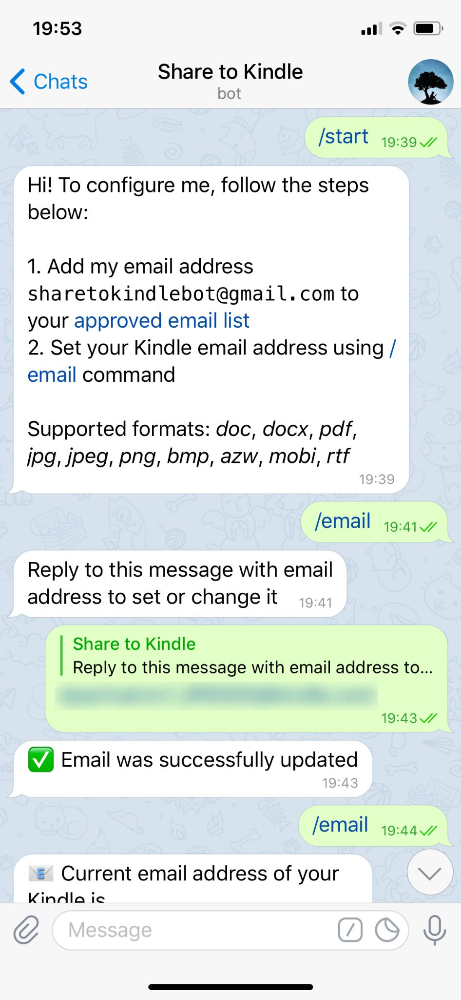
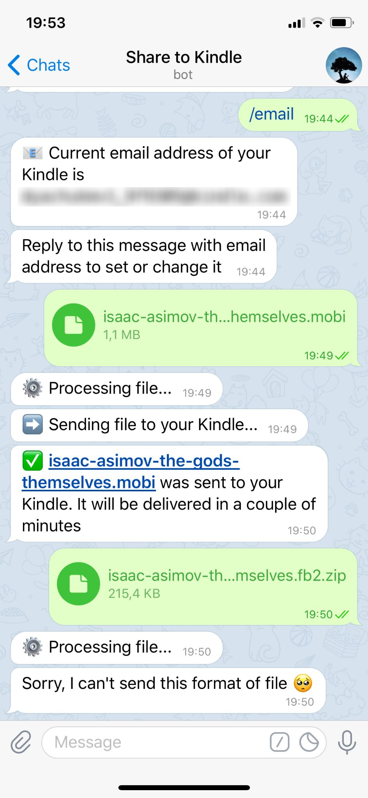

# Share to Kindle
### About

This is a Telegram bot, which allows you to send send e-books and other supported formats of files to your Kindle.

The bot is written in Java using [TelegramBots](https://github.com/rubenlagus/TelegramBots) library, JDBC for accessing data stored in PostgreSQL and JavaMail API, deployed on Heroku.

Examples of work:

